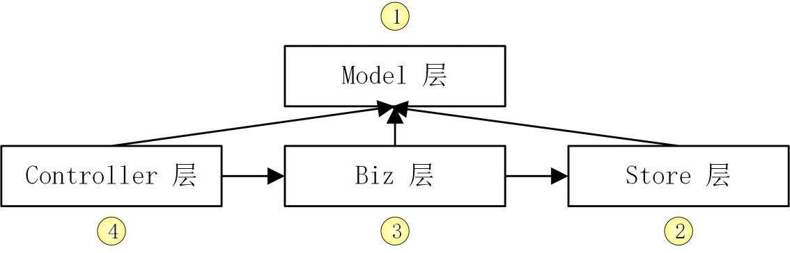

# Gd-Blog
Gd-Blog 是一个基于 Go 语言开发的博客系统  
使用了 `Golang` + `Gin` + `MySQL` + `Docker` + `Nginx`

## Features
- 使用了简洁架构,目录结构规范清晰
- 使用众多常用 Go 包
- 具备认证 (Gin JWT) 以及授权 (Casbin) 功能
- 独立封装 log, error 包
- 使用 Makefile 高效管理项目
- 静态代码检查
- 带有单元测试,性能测试,模糊测试,Mock测试
- 实现了众多的 Web 功能
  - HTTP, HTTPS, gRPC
  - 优雅关停,中间件,跨域,异常恢复
- 使用 MariaDB 存储数据
- RESTful API 设计规范以及 OpenAPI 3.0/Swagger 2.0 API 文档
- 支持 Docker 部署
- 完善的文档

## Installation

```shell
git clone git@github.com:Gidi233/Gd-Blog.git

cd Gd-Blog

make tool.verify && make ca && make

./_output/platforms/linux/amd64/Gd-Blog -c configs/GdBlog.yaml
```


## 基于 Nginx 实现高可用
[Nginx+Keepalived 保证 Gd-Blog 高可用](./docs/devel/zh-CN/conversions/Nginx.md)

## Documentation
### 实现功能
[openAPI文档](api/openapi/openapi.yaml)  
[Postman文档](https://documenter.getpostman.com/view/30435589/2s9YR83t3M)
- 用户管理
  - 用户注册
  - 用户登录
  - 获取用户列表
  - 获取用户详情
  - 更新用户信息
  - 修改用户密码
  - 注销用户
    - 基于 MySQL 触发器会自动删除用户所有博客并清除权限
- 博客管理
  - 创建博客
  - 获取博客列表
  - 获取博客详情
  - 更新博客
  - 删除博客
  - 批量删除博客

### 业务架构模型
- 模型层 -- 控制层 -- 业务层 -- 仓库层
- model -- controller -- biz -- store
- 存储对象结构与其方法 -- 业务路由 -- 业务逻辑处理 -- 与数据库/第三方服务进行 CRUD

- 开发顺序:
  - Model -> Store -> Biz -> Controller
  - 从下到上，优先开发依赖少的组件
  - 一次性开发完一整条链路, 从而保证整个链路的可用性


- model 层就是数据库表字段的 Go 结构体映射,根据数据库表用[db2struct](https://github.com/Shelnutt2/db2struct)生成 Model 文件。
- store 层封装了数据库操作,用了单例模式创建`*gorm.DB`。
- Biz 层封装了业务逻辑，依赖 store 层。 
- Controller 层进行参数解析、参数校验、逻辑分发处理、请求返回操作。（注册删除用户时，在数据库操作授权策略）

### 日志系统
[基于 zap 构建可自定义的日志系统](docs/devel/zh-CN/conversions/log.md)

### 认证授权系统
[Gd-Blog的认证与授权](./docs/devel/zh-CN/conversions/auth.md)

### HTTPS 的使用
[使用HTTPS](./docs/devel/zh-CN/conversions/https.md)

---

## License
[MIT](https://choosealicense.com/licenses/mit/)